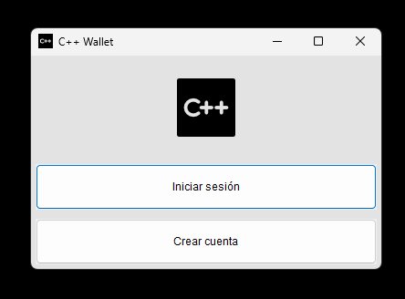
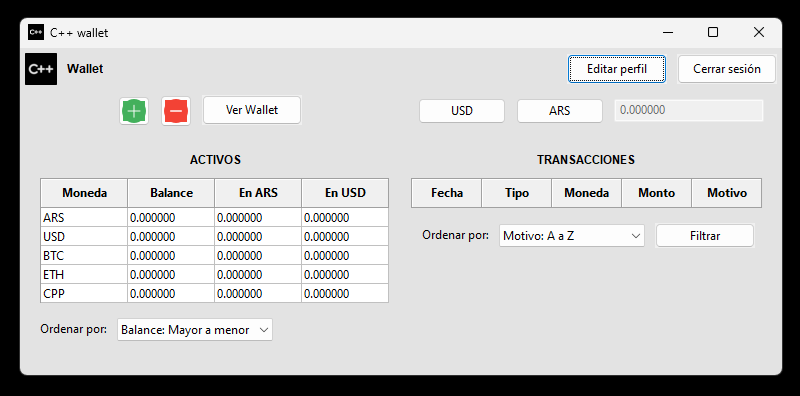
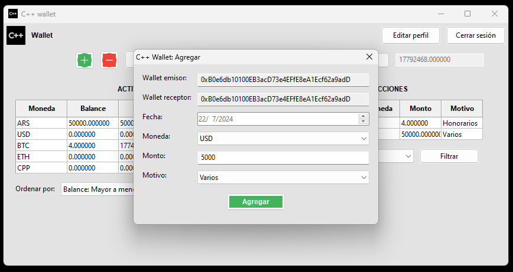

# WX Wallet

## Descripción

Aplicación de billetera diseñada e implementada utilizando C++ y wxWidgets. La aplicación permite a los usuarios cargar monedas, enviar/recibir dinero, gestionar y visualizar balances totales e individuales, y ordenar los balances por cantidad más alta/baja, nombre u otros criterios. Trabajo Final para la asignatura de "Programación Orientada a Objetos" de la carrera de Ingeniería en Informática (FICH-UNL).

Integrantes:

- Rodriguez, Lautaro
- Rufiner, Santiago

## Funcionalidades

- **Carga de Monedas**: Los usuarios pueden cargar diferentes monedas en la aplicación.
- **Envío y Recepción de Dinero**: Permite enviar/recibir dinero dentro de la aplicación.
- **Gestión de Balances**: Permite gestionar y visualizar tanto balances totales como individuales por moneda.
- **Ordenamiento de Balances y Transacciones**: Permite ordenar los balances por cantidad (mayor a menor, menor a mayor), nombre de la moneda (A a Z, Z a A), y las transacciones por fecha, monto o motivo (A a Z, Z a A).

### App

## Instrucciones para probar la aplicación

1. Descargar la carpeta `src` desde el repositorio y abrirla.
3. Dentro de la carpeta `src`, ejecutar el archivo `wxWallet.exe` para iniciar la aplicación.
